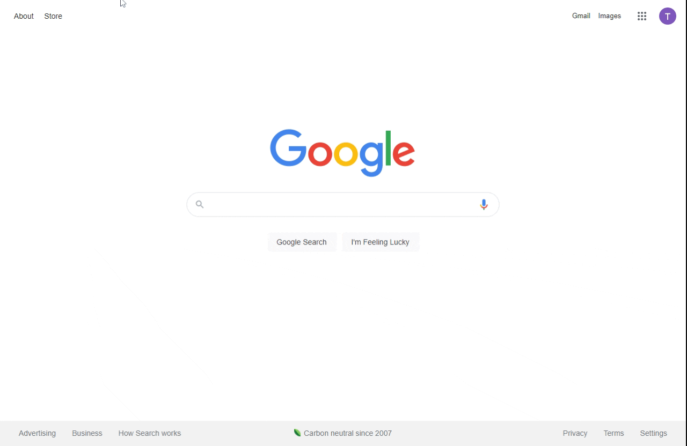

# Emerald-Investments-project

# MVP's

# Frontend

- Uses React/Redux (todo: add screen shots and paragraph)

# Backend

- Uses express/sequelize to route API calls to proper action and return correct data. (todo: add screen shots and paragraph)

# Components

# Database Schema

# API Endpoints

## GET
      "/"
      "/login"

## POST
      "/login"
      
## NEXT STEPS
      integrate NextAuth.js
      integrate StepZen backend
  
      

# Technologies Used

- Node-JS 
- Express 
- React 
- Redux 
- Sequelize
- SQL
- PostgreSQL
- Chart-js
